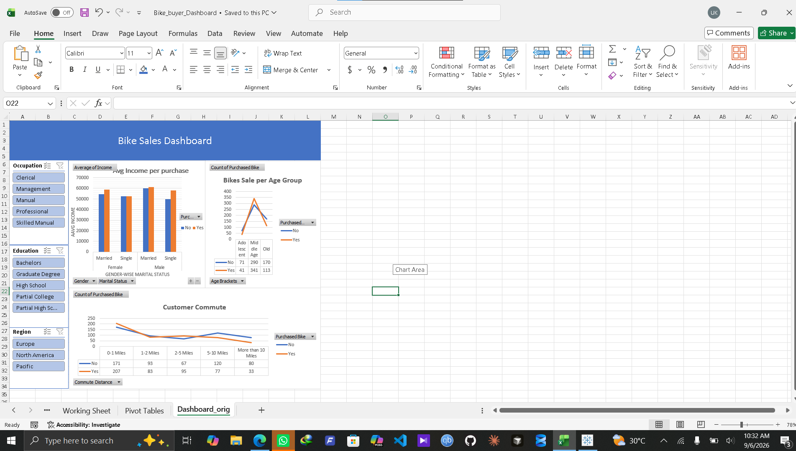

# 🚴 Bike Sales Performance & Customer Demographics Dashboard

## 📌 Project Overview
This project analyzes customer demographics and purchasing behavior for a bike retail dataset. Using Microsoft Excel, raw customer data was cleaned, structured using Pivot Tables, and visualized through dynamic Pivot Charts. The final deliverable is an interactive dashboard allowing users to filter sales metrics across regions, occupations, and education levels.

---

## 📸 Dashboard Preview

---

## 🔍 Key Business Insights
1. **Income & Purchases:** On average, customers who purchased a bike had a higher average income compared to non-buyers across both male and female demographics.
2. **Commute Distance Impact:** Short-distance commuters (**0–1 miles**) account for the highest bike purchasing volume. Purchase likelihood drops sharply for commutes exceeding 10 miles.
3. **Age Demographic:** The middle-aged customer segment (**31–54**) represents the largest consumer base and generates the majority of total bike sales.

---

## 🛠️ Excel Tools & Techniques Applied
* **Data Cleaning & Preprocessing:** Standardized data types, removed duplicate records, and categorized raw ages into distinct age brackets using nested conditional logic.
* **Pivot Tables:** Built summary tables analyzing `Average Income`, `Commute Distance`, and `Purchase Counts`.
* **Pivot Charts:** Designed clustered column charts and line graphs to display multi-variable trends.
* **Interactive Slicers:** Added dynamic Slicers (`Occupation`, `Education`, `Region`) and configured **Report Connections** across all dashboard charts for synchronized filtering.

---

## 📁 Files in This Directory
* `Bike_buyer_Dashboard.xlsx` — Main Excel workbook containing the raw dataset, working sheets, pivot tables, and interactive dashboard.
* `dashboard_preview.png` — Screenshot preview of the final dashboard.
* `README.md` — Project documentation.

---

## 🚀 How to View the Project
1. Download `Bike_buyer_Dashboard.xlsx` from this directory.
2. Open the file in **Microsoft Excel**.
3. Navigate to the `Dashboard` tab to interact with the slicers and filter the visuals.
