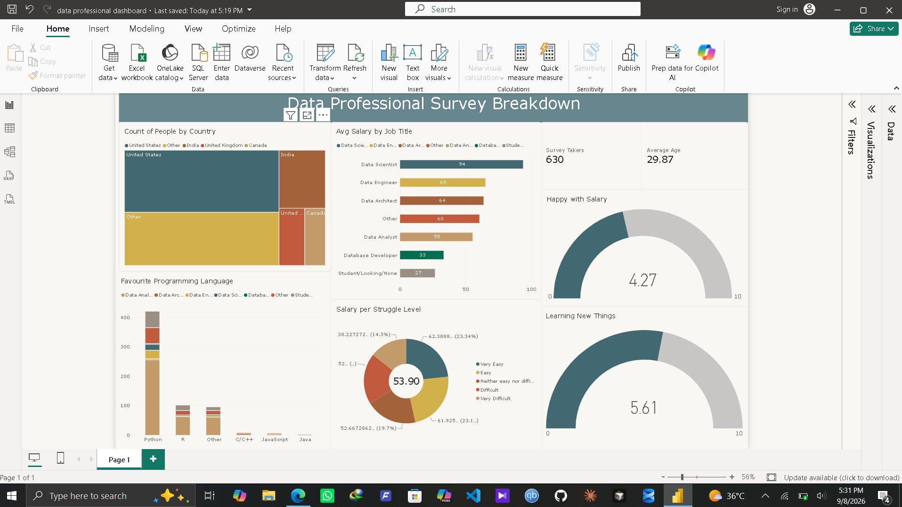

# 📊 Data Professional Survey Breakdown (Power BI)

## 📌 Executive Summary
An interactive Power BI dashboard analyzing career paths, compensation, demographics, and software preferences for over 630 data professionals globally. This project demonstrates end-to-end business intelligence workflows, including ETL in Power Query, dimensional modeling, and dynamic DAX visualizations.

---

## 📸 Dashboard Preview

---

## 🔑 Key Insights
* **Top Earning Roles:** Data Scientists and Data Architects lead average compensation across surveyed professionals.
* **Tech Stack Dominance:** Python emerges as the primary programming language across Data Analysts, Engineers, and Scientists.
* **Work-Life Balance vs. Salary:** Surveyed respondents rated higher satisfaction with Learning/Work-Life Balance (~5.6/10) compared to Salary Satisfaction (~4.2/10).

---

## 🛠️ Tech Stack & Methods
* **Tool:** Power BI Desktop
* **Data Transformation:** Power Query Editor (data type conversion, column splitting, null handling)
* **Modeling:** Star Schema with single-direction filtering
* **Analytics:** DAX (Calculated Measures & Custom Visual Filters)

---

## 📁 Repository Contents
* `data-professional-dashboard.pbix` — Power BI source file
* `dashboard-preview.png` — Visual dashboard preview
* `Data Professional Survey Raw Data.csv` — Raw dataset
