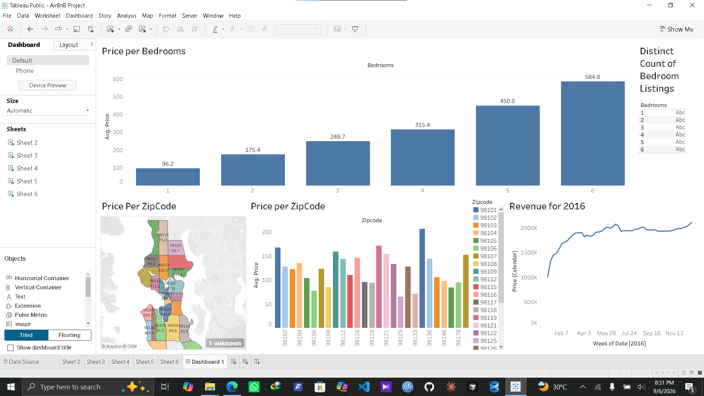

# 🏡 Seattle Airbnb Real Estate & Revenue Analysis

## 📌 Project Overview
This project analyzes the 2016 Seattle Airbnb market to evaluate pricing trends, spatial revenue distribution across geographic zip codes, and listing capacity performance. Using Tableau Public, raw property listing data was structured and visualized into an interactive visual dashboard for real estate investors and hosts.

---

## 📸 Dashboard Preview

🔗 **[View Live Interactive Dashboard on Tableau Public](https://public.tableau.com/app/profile/urwa.kaleem/viz/AirBnBProject_17887093063570/Dashboard1?publish=yes)**

---

## 🔍 Key Business Insights
1. **Pricing by Capacity:** Average listing prices scale predictably with bedroom count, ranging from **$96.20** for 1-bedroom properties up to **$584.80** for 6-bedroom listings.
2. **Geographic Premium:** Spatial breakdown across Seattle zip codes highlights premium clusters, with zip code `98134` averaging the highest prices per night (over **$200/night**).
3. **Revenue Seasonality:** Analysis of 2016 weekly revenue demonstrates steady demand growth starting in early spring, peaking through late summer (July–September) before stabilizing near year-end.

---

## 🛠️ Tableau Techniques & Features Applied
* **Geographic Mapping:** Configured zip-code-level filled map layers utilizing generated Latitude and Longitude spatial fields.
* **Aggregations & Calculated Metrics:** Built custom charts using `Avg. Price`, `Distinct Count of Bedroom Listings`, and weekly summed `Revenue (Calendar)`.
* **Dashboard Composition & Interactivity:** Designed a multi-chart grid layout with synchronized tooltips, legends, and dynamic zip code color encoding.

---

## 📁 Files in This Directory
* `AirBnB Project.twb` — Tableau workbook file containing worksheet definitions and dashboard layouts.
* `dataset_airbnb.xlsx` — Source Excel dataset containing Listings, Calendar, and Reviews tables.
* `dashboard_preview.png` — High-resolution screenshot preview of the interactive dashboard.
* `README.md` — Project documentation.
